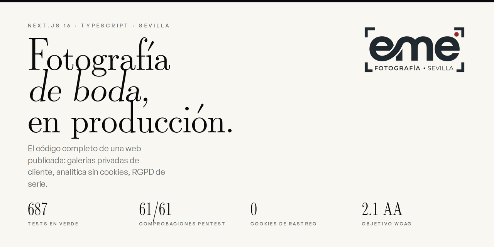
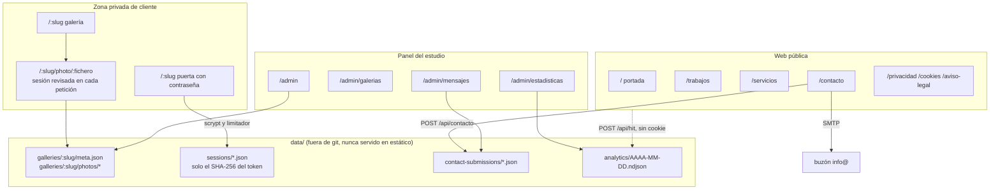

<div align="center">



# EME Fotografía Sevilla

**El código completo de la web de un estudio de fotografía de boda, funcionando en producción.**
Galerías privadas de cliente, analítica sin cookies, cumplimiento del RGPD de serie y una
batería de pruebas de seguridad que se ejecuta contra el dominio publicado.

[](https://github.com/escalartica/eme_fotografia/actions/workflows/ci.yml)
[](#pruebas)
[](#seguridad)
[](https://nextjs.org)
[](https://www.typescriptlang.org)
[](LICENSE)

**[Web publicada](https://www.emefotografiasevilla.com)** · [Arquitectura](docs/ARCHITECTURE.md) · [Read in English](README.md)

</div>

---

## Qué es esto

Casi todos los repositorios de portafolio son demos. Este no: es la web que un estudio de
Sevilla usa a diario. Sus clientes entran a elegir fotos, las solicitudes llegan por aquí y el
tráfico se mide desde dentro. Se publica entero para que las decisiones que hay detrás se
puedan leer, discutir y reutilizar.

Lo interesante no son las fotos de boda. Son las condiciones que una web de negocio pequeño
tiene que cumplir de verdad, resueltas sin apoyarse en ninguna plataforma:

- **Galerías privadas sin base de datos.** El cliente abre una URL, escribe su contraseña y ve
  solo su boda. Las fotos nunca están en una carpeta accesible por URL.
- **Analítica sin cookies y sin banner que esquivar.** Visitas, referentes y dispositivos se
  miden en propio, con un hash que rota cada día y no se puede revertir.
- **RGPD y LSSI como requisito de construcción, no como enlace en el pie.** Nada de terceros
  carga hasta que el visitante decide, y rechazar cuesta exactamente lo mismo que aceptar.
- **Autenticación sin dependencias.** El hash de contraseñas, las sesiones y el limitador de
  intentos están hechos con el `crypto` de Node, y el porqué está escrito en el propio código.

## De un vistazo

| | |
|---|---|
| **Framework** | Next.js 16 (App Router, React 19, Turbopack) |
| **Lenguaje** | TypeScript 5, estricto |
| **Movimiento** | GSAP 3 y Lenis, todo condicionado a `prefers-reduced-motion` |
| **Estilos** | CSS Modules y tokens de diseño, sin framework de utilidades |
| **Persistencia** | Ficheros JSON y NDJSON en disco. Sin base de datos |
| **Auth** | scrypt del `crypto` de Node, sesiones opacas en servidor, sin librería de JWT |
| **Correo** | Nodemailer contra el SMTP del propio estudio |
| **Imágenes** | `sharp`, derivadas generadas bajo demanda y cacheadas |
| **Pruebas** | Vitest y Testing Library, 687 tests en 92 ficheros |
| **Seguridad** | 61 comprobaciones HTTP ejecutables contra producción |
| **Hosting** | VPS Linux gestionado por el estudio, nginx, Let's Encrypt |

## Arquitectura



La explicación completa, con el modelo de datos y la topología del despliegue, está en
**[docs/ARCHITECTURE.md](docs/ARCHITECTURE.md)**.

## Lo que merece la pena leer

### Galerías privadas de cliente

Cada boda es una carpeta en `data/galleries/<slug>/`: un `meta.json` con las credenciales del
cliente y la lista de fotos, una carpeta `photos/` y el `selection.json` con lo que ha elegido.
Nada de eso vive en `public/`.

Y ese es el diseño entero. Un fichero en `public/` es accesible por URL para siempre y no hay
forma de ponerle una comprobación delante, así que un nombre de fichero filtrado derrota la
contraseña de manera permanente. En su lugar, cada imagen pasa por
[`app/[slug]/photo/[filename]/route.ts`](app/%5Bslug%5D/photo/%5Bfilename%5D/route.ts), que
vuelve a validar la sesión en cada petición. Cerrar sesión corta las fotos, no solo la página
que las rodea.

| Asunto | Dónde | Cómo |
|---|---|---|
| Hash de contraseñas | [`lib/auth/password.ts`](lib/auth/password.ts) | `scrypt` de Node, formato versionado `scrypt:sal:hash`, comparación en tiempo constante |
| Sesiones | [`lib/auth/session.ts`](lib/auth/session.ts) | Tokens opacos aleatorios; en disco solo se escribe su SHA-256, así que una copia de seguridad filtrada no da nada presentable como cookie |
| Fuerza bruta | [`lib/auth/rate-limit.ts`](lib/auth/rate-limit.ts) | Ventana deslizante en memoria, con tope de claves vivas para que un `X-Forwarded-For` falsificado no la agote |
| Salto de directorio | [`lib/gallery-store.ts`](lib/gallery-store.ts) | Listas de permitidos de formato, no de prohibidos |
| Escrituras entre orígenes | [`lib/auth/origin-check.ts`](lib/auth/origin-check.ts) | Origen comprobado en toda ruta que modifica algo |

### Analítica sin cookies

[`lib/analytics-store.ts`](lib/analytics-store.ts) escribe una línea NDJSON por visita. Sin
cookie, sin `localStorage`, sin guardar la IP. Los visitantes únicos se cuentan con un hash de
(sal que rota a diario + IP + agente de usuario): irreversible, y mañana vale otra cosa. Es el
modelo que la AEPD y la CNIL aceptan sin consentimiento, y por eso el estudio tiene números
reales mientras el banner de cookies sigue sin cargar nada hasta que el visitante decide.

### Un pentest que se puede ejecutar

`npm test` llama a las funciones por dentro. [`scripts/pentest.mjs`](scripts/pentest.mjs) hace
lo contrario: ataca al servidor por HTTP como lo haría alguien de fuera, y encuentra lo que un
test unitario no puede ver. Una cabecera que no llega, una redirección que se salta una
comprobación, un fichero de datos servido por descuido.

```bash
npm run pentest                                              # contra localhost:3000
npm run pentest -- https://www.emefotografiasevilla.com      # contra producción
```

61 comprobaciones, 61 correctas contra el dominio publicado: CSP, HSTS, las cabeceras de caché
del panel, el manejo de sesiones, intentos de salto de directorio y entradas hostiles en los
formularios.

### Movimiento que respeta al visitante

GSAP y Lenis mueven el scroll, la intro cinematográfica y las transiciones de página. Todos
leen `prefers-reduced-motion` a través de
[`lib/hooks/useReducedMotion.ts`](lib/hooks/useReducedMotion.ts) y tienen una versión quieta, y
cada vídeo de ambiente lleva un control de pausa de verdad en vez de un autoplay que no se puede
parar. El objetivo de accesibilidad del proyecto es WCAG 2.1 AA.

## Puesta en marcha

Requiere Node 20 o posterior.

```bash
git clone https://github.com/escalartica/eme_fotografia.git
cd eme_fotografia
npm ci
cp .env.example .env.local     # léelo, está comentado
npm run dev
```

En desarrollo, si el panel no está configurado, se imprimen unas credenciales aleatorias de un
solo arranque para poder ver las páginas públicas enseguida. En producción,
`instrumentation.ts` se niega a levantar un servidor con el panel mal configurado, a propósito.

> **Sobre el peso del clon.** Ahora mismo el repositorio lleva las fotos y los vídeos del estudio
> dentro de git, así que un clon completo es grande. En [Notas del repositorio](#notas-del-repositorio)
> está el porqué y el plan para arreglarlo.

### Comandos

| Comando | Qué hace |
|---|---|
| `npm run dev` | Servidor de desarrollo |
| `npm run build` | Build de producción |
| `npm start` | Sirve el build de producción |
| `npm test` | Suite de Vitest, 687 tests |
| `npm run lint` | ESLint |
| `npm run pentest` | Comprobaciones de seguridad por HTTP contra un servidor en marcha |

## Estructura del proyecto

```
app/
  (site)/        páginas públicas: portada, trabajos, servicios, contacto, legales
  [slug]/        galerías privadas de cliente y la ruta protegida de fotos
  admin/         panel del estudio: galerías, mensajes, estadísticas
  api/           contacto, acceso a galerías, selecciones, beacon de analítica
components/
  motion/        primitivas de GSAP y Lenis, todas conscientes del reduced-motion
  layout/        cabecera, pie, menú móvil
  consent/       el aviso de cookies
content/         textos, reportajes, servicios, testimonios y FAQ como datos tipados
lib/             auth, almacenes, SEO, schema.org, tratamiento de imágenes
docs/            arquitectura, runbook de despliegue, auditorías, trabajo pendiente
scripts/         pentest, etalonaje de fotos, hash de contraseñas
```

Los textos viven en `content/` como TypeScript tipado y no dentro de los componentes, para que
las palabras del estudio se revisen en un solo sitio sin tocar la maquetación.

## Pruebas

```bash
npm test
```

687 tests en 92 ficheros, que cubren los flujos de autenticación, los almacenes, la salida de
SEO y JSON-LD, las páginas legales, el aviso de cookies, los componentes de movimiento y las
rutas de API. La CI ejecuta lint, generación de tipos, typecheck y la suite completa en cada
push y cada pull request.

## Seguridad

Si encuentras algo, cuéntalo como se debe: [SECURITY.md](SECURITY.md).

Las cabeceras de seguridad están en [`next.config.mjs`](next.config.mjs) y escritas contra lo
que esta web carga de verdad, no copiadas de una plantilla: una Content-Security-Policy real,
HSTS, `X-Frame-Options: DENY`, `X-Content-Type-Options`, `Referrer-Policy` y una
`Permissions-Policy`. El pentest las comprueba contra el servidor vivo en lugar de fiarse de la
configuración.

No hay ningún secreto en el repositorio. Las credenciales salen del entorno, el `.gitignore`
cubre material de claves como red de seguridad y al lado de cada regla está escrito por qué
existe.

## Despliegue

La web corre en un VPS Linux gestionado por el estudio, con nginx y Let's Encrypt, no en una
plataforma gestionada. El runbook completo, incluido por qué se descartó cada alternativa, está
en [docs/DESPLIEGUE.md](docs/DESPLIEGUE.md).

## Notas del repositorio

Dos cosas que conviene decir claras en vez de esconderlas:

1. **El repositorio pesa.** Hay unos 626 MB de fotos y vídeo dentro de git, porque el despliegue
   actual clona `public/` directamente de GitHub. Sacarlos obliga a cambiar cómo recibe el
   servidor su material, y esa migración está deliberadamente aparcada mientras el estudio y sus
   clientes trabajan desde la web publicada. El plan seguro está en
   [docs/PLAN-MEDIA-FUERA-DE-GIT.md](docs/PLAN-MEDIA-FUERA-DE-GIT.md).
2. **La rama por defecto es `worktree-eme-fotografia-build`.** Es un resto de cómo se construyó
   el proyecto. El servidor de producción clona esa rama por su nombre exacto, así que
   renombrarla va junto al cambio anterior y no por separado.

El historial está en español y escrito para personas: cada mensaje dice qué cambia para quien
usa la web, no qué función se tocó.

## Documentación

| Documento | Contenido |
|---|---|
| [docs/ARCHITECTURE.md](docs/ARCHITECTURE.md) | Diseño del sistema, modelo de datos, flujos de petición |
| [docs/DESPLIEGUE.md](docs/DESPLIEGUE.md) | Runbook de despliegue del VPS |
| [docs/PENDIENTE.md](docs/PENDIENTE.md) | Todo lo aparcado a propósito, y de quién depende |
| [docs/PAQUETE-GALERIAS.md](docs/PAQUETE-GALERIAS.md) | Plan para extraer el sistema de galerías como paquete reutilizable |
| [docs/AJUSTES-GITHUB.md](docs/AJUSTES-GITHUB.md) | Ajustes del repositorio que viven en GitHub y no en un fichero |
| [docs/PATRONES-AWWWARDS.md](docs/PATRONES-AWWWARDS.md) | Patrones de webs premiadas estudiados, y cuáles se descartaron |
| [docs/AUDITORIA-COMPLETA.md](docs/AUDITORIA-COMPLETA.md) | Auditoría medida de contraste, maquetación y movimiento |

## Licencia

Está partida a propósito, porque las dos mitades no son el mismo tipo de trabajo.

- **El código** es [MIT](LICENSE). Léelo, apréndelo, reutilízalo, publícalo.
- **Las fotografías, los vídeos, la marca EME y los textos de la web** son todos los derechos
  reservados. Ver [NOTICE.md](NOTICE.md). Todas las personas que aparecen en las fotos firmaron
  un consentimiento para su uso por el estudio; ese consentimiento no te alcanza a ti.

## Créditos

Fotografía y vídeo de **EME Fotografía Sevilla**, Sevilla, Andalucía.
Diseño e ingeniería de la web realizados con Claude Code, y documentados sobre la marcha.

[www.emefotografiasevilla.com](https://www.emefotografiasevilla.com) ·
[Instagram](https://www.instagram.com/eme_fotografia_sevilla)
