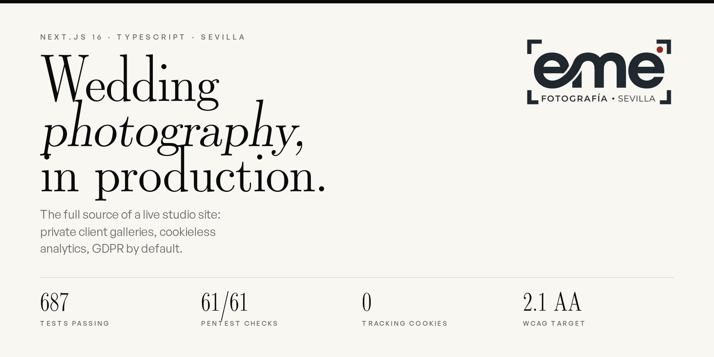
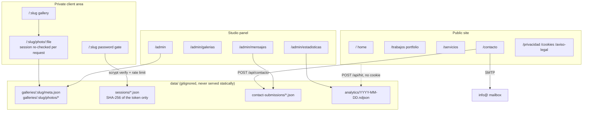

<div align="center">



# EME Fotografía Sevilla

**The complete source of a wedding photography studio's website, running in production.**
Private client galleries, cookie-less analytics, GDPR compliance by default, and a security
test suite that runs against the published domain.

[](https://github.com/escalartica/eme_fotografia/actions/workflows/ci.yml)
[](#testing)
[](#security)
[](https://nextjs.org)
[](https://www.typescriptlang.org)
[](LICENSE)

**[Live site](https://www.emefotografiasevilla.com)** · [Architecture](docs/ARCHITECTURE.md) · [Leer en español](README.es.md)

</div>

---

## What this is

Most portfolio repositories are demos. This one is the site a working studio in Seville uses
every day: their clients log into it to pick photographs, their enquiries arrive through it,
and their traffic is measured by it. It is published here in full so the decisions behind it
can be read, argued with, and reused.

The interesting parts are not the wedding photographs. They are the constraints a small
business site actually has to satisfy, solved without reaching for a platform:

- **Private galleries without a database.** Clients open a URL, enter a password, and see
  only their own wedding. Photographs never sit in a publicly reachable directory.
- **Analytics with no cookies and no consent banner to dodge.** Visits, referrers and
  devices are measured first-party, with a daily-rotating hash that cannot be reversed.
- **GDPR and LSSI as a build requirement, not a footer link.** Nothing third-party loads
  until the visitor chooses, and rejecting is exactly as easy as accepting.
- **No authentication dependencies.** Password hashing, sessions and rate limiting are built
  on Node's own `crypto`, with the reasoning written down in the code.

## At a glance

| | |
|---|---|
| **Framework** | Next.js 16 (App Router, React 19, Turbopack) |
| **Language** | TypeScript 5, strict |
| **Motion** | GSAP 3 + Lenis, every effect gated on `prefers-reduced-motion` |
| **Styling** | CSS Modules + design tokens, no utility framework |
| **Persistence** | Plain JSON and NDJSON files on disk. No database |
| **Auth** | Node `crypto` scrypt, opaque server-side sessions, no JWT library |
| **Mail** | Nodemailer over the studio's own SMTP |
| **Images** | `sharp`, derivatives generated on demand and cached |
| **Tests** | Vitest + Testing Library, 687 tests across 92 files |
| **Security** | 61-check HTTP pentest harness runnable against production |
| **Hosting** | Self-managed Linux VPS, nginx, Let's Encrypt |

## Architecture



The full write-up, including the data model and the deployment topology, is in
**[docs/ARCHITECTURE.md](docs/ARCHITECTURE.md)**.

## Highlights worth reading

### Private client galleries

Each wedding is a directory under `data/galleries/<slug>/`: a `meta.json` holding the client
credentials and photo list, a `photos/` folder, and the client's `selection.json`. Nothing
lives under `public/`.

That last point is the whole design. A file under `public/` is reachable by URL forever, with
no way to gate it, so a leaked filename permanently defeats the password. Instead every image
goes through [`app/[slug]/photo/[filename]/route.ts`](app/%5Bslug%5D/photo/%5Bfilename%5D/route.ts),
which re-validates the session on every single request. Logging out cuts off the photographs,
not just the page around them.

| Concern | Where | Approach |
|---|---|---|
| Password hashing | [`lib/auth/password.ts`](lib/auth/password.ts) | Node `scrypt`, versioned `scrypt:salt:hash` format, timing-safe compare |
| Sessions | [`lib/auth/session.ts`](lib/auth/session.ts) | Opaque random tokens; only their SHA-256 is written to disk, so a leaked backup yields nothing presentable as a cookie |
| Brute force | [`lib/auth/rate-limit.ts`](lib/auth/rate-limit.ts) | Sliding window in memory, with a hard cap on live keys so a spoofed `X-Forwarded-For` cannot exhaust it |
| Path traversal | [`lib/gallery-store.ts`](lib/gallery-store.ts) | Format allowlists for slugs and filenames, not blocklists |
| Cross-origin writes | [`lib/auth/origin-check.ts`](lib/auth/origin-check.ts) | Origin verified on every mutating route |

### Analytics without cookies

[`lib/analytics-store.ts`](lib/analytics-store.ts) writes one NDJSON line per page view. No
cookie, no `localStorage`, no stored IP. Unique visitors are counted through a hash of
(daily rotating salt + IP + user agent): irreversible, and a different value tomorrow. This is
the model the Spanish AEPD and the French CNIL accept without consent, which is why the studio
gets real numbers while the cookie banner still loads nothing until the visitor chooses.

### A pentest you can actually run

`npm test` calls the functions from the inside. [`scripts/pentest.mjs`](scripts/pentest.mjs)
does the opposite: it attacks a running server over HTTP the way a stranger would, and finds
what a unit test structurally cannot. A missing header, a redirect that skips a check, a data
file served by accident.

```bash
npm run pentest                                              # against localhost:3000
npm run pentest -- https://www.emefotografiasevilla.com      # against production
```

61 checks, 61 passing against the published domain: CSP, HSTS, the admin panel's cache
headers, session handling, traversal attempts, hostile form input.

### Motion that respects the visitor

GSAP and Lenis drive the scroll work, the cinematic intro and the page transitions. Every one
of them reads `prefers-reduced-motion` through
[`lib/hooks/useReducedMotion.ts`](lib/hooks/useReducedMotion.ts) and has a still fallback, and
each ambient video has a real pause control rather than an unstoppable autoplay. The project's
accessibility target is WCAG 2.1 AA.

## Getting started

Requires Node 20 or newer.

```bash
git clone https://github.com/escalartica/eme_fotografia.git
cd eme_fotografia
npm ci
cp .env.example .env.local     # see the notes inside it
npm run dev
```

In development the admin panel prints one-off random credentials at startup if it has not been
configured, so you can browse the public pages immediately. For production, `instrumentation.ts`
refuses to start a server whose panel is misconfigured, on purpose.

> **Note on clone size.** The repository currently carries the studio's photographs and video in
> git, so a full clone is large. See [Repository notes](#repository-notes) for why, and for the
> planned fix.

### Commands

| Command | What it does |
|---|---|
| `npm run dev` | Development server |
| `npm run build` | Production build |
| `npm start` | Serve the production build |
| `npm test` | Vitest suite, 687 tests |
| `npm run lint` | ESLint |
| `npm run pentest` | HTTP security checks against a running server |

## Project layout

```
app/
  (site)/        public pages: home, portfolio, services, contact, legal
  [slug]/        private client galleries and the protected photo route
  admin/         studio panel: galleries, messages, statistics
  api/           contact, gallery auth, selections, analytics beacon
components/
  motion/        GSAP and Lenis primitives, all reduced-motion aware
  layout/        header, footer, mobile menu
  consent/       the cookie banner
content/         site copy, projects, services, testimonials, FAQ as typed data
lib/             auth, stores, SEO, schema.org, image handling
docs/            architecture, deployment runbook, audits, pending work
scripts/         pentest harness, photo grading, password hashing
```

Site copy lives in `content/` as typed TypeScript rather than in the components, so the studio's
words can be reviewed in one place without touching layout.

## Testing

```bash
npm test
```

687 tests in 92 files, covering the auth flows, the stores, SEO and JSON-LD output, the legal
pages, the consent banner, the motion components and the API routes. CI runs lint, type
generation, typecheck and the full suite on every push and pull request.

## Security

Reported responsibly, please: see [SECURITY.md](SECURITY.md).

Security headers are defined in [`next.config.mjs`](next.config.mjs) and written against what
this site actually loads, not copied from a template: a real Content-Security-Policy, HSTS,
`X-Frame-Options: DENY`, `X-Content-Type-Options`, `Referrer-Policy` and a `Permissions-Policy`.
The pentest harness verifies them against the live server rather than trusting the config.

No secret is committed. Credentials come from the environment, `.gitignore` covers key material
as a safety net, and the reason each rule exists is written next to it.

## Deployment

The site runs on a self-managed Linux VPS with nginx and Let's Encrypt, not a managed platform.
The full runbook, including why each alternative was rejected, is in
[docs/DESPLIEGUE.md](docs/DESPLIEGUE.md) (Spanish).

## Repository notes

Two things a visitor should know, stated plainly rather than hidden:

1. **The repository is heavy.** Roughly 626 MB of photographs and video are tracked in git,
   because the current deployment clones `public/` straight from GitHub. Removing them means
   changing how the server gets its media, and that migration is deliberately not being done
   while the studio and its clients are working from the live site. The safe plan is written up
   in [docs/PLAN-MEDIA-FUERA-DE-GIT.md](docs/PLAN-MEDIA-FUERA-DE-GIT.md).
2. **The default branch is `worktree-eme-fotografia-build`.** An artefact of how the project was
   built. The production server pulls that exact branch by name, so renaming it is scheduled
   alongside the change above rather than done in isolation.

The commit history is in Spanish and written for humans: each message says what changed for the
person using the site, not which function was touched.

## Documentation

| Document | Contents |
|---|---|
| [docs/ARCHITECTURE.md](docs/ARCHITECTURE.md) | System design, data model, request flows |
| [docs/DESPLIEGUE.md](docs/DESPLIEGUE.md) | Deployment runbook for the VPS |
| [docs/PENDIENTE.md](docs/PENDIENTE.md) | Everything deliberately parked, and who owns it |
| [docs/PAQUETE-GALERIAS.md](docs/PAQUETE-GALERIAS.md) | Plan to extract the gallery system as a reusable package |
| [docs/AJUSTES-GITHUB.md](docs/AJUSTES-GITHUB.md) | Repository settings that live in GitHub rather than in a file |
| [docs/PATRONES-AWWWARDS.md](docs/PATRONES-AWWWARDS.md) | Award-site patterns studied, and which were rejected |
| [docs/AUDITORIA-COMPLETA.md](docs/AUDITORIA-COMPLETA.md) | Measured audit of contrast, layout and motion |

## License

Split deliberately, because the two halves are not the same kind of work.

- **Code** is [MIT](LICENSE). Read it, learn from it, reuse it, ship it.
- **Photographs, video, the EME wordmark and the site's written copy** are all rights reserved.
  See [NOTICE.md](NOTICE.md). Everyone appearing in the photographs signed a consent form for
  their use by the studio; that consent does not extend to you.

## Credits

Photography and video by **EME Fotografía Sevilla**, Seville, Andalusia.
Site design and engineering carried out with Claude Code, and documented as it went.

[www.emefotografiasevilla.com](https://www.emefotografiasevilla.com) ·
[Instagram](https://www.instagram.com/eme_fotografia_sevilla)
