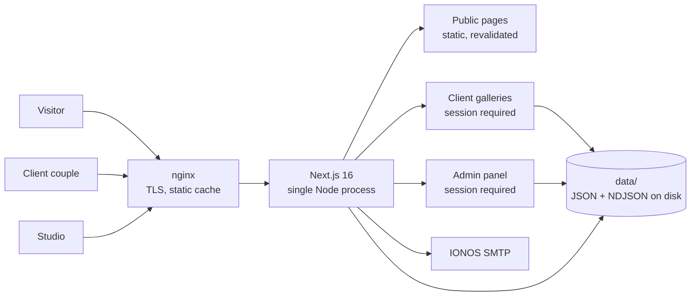
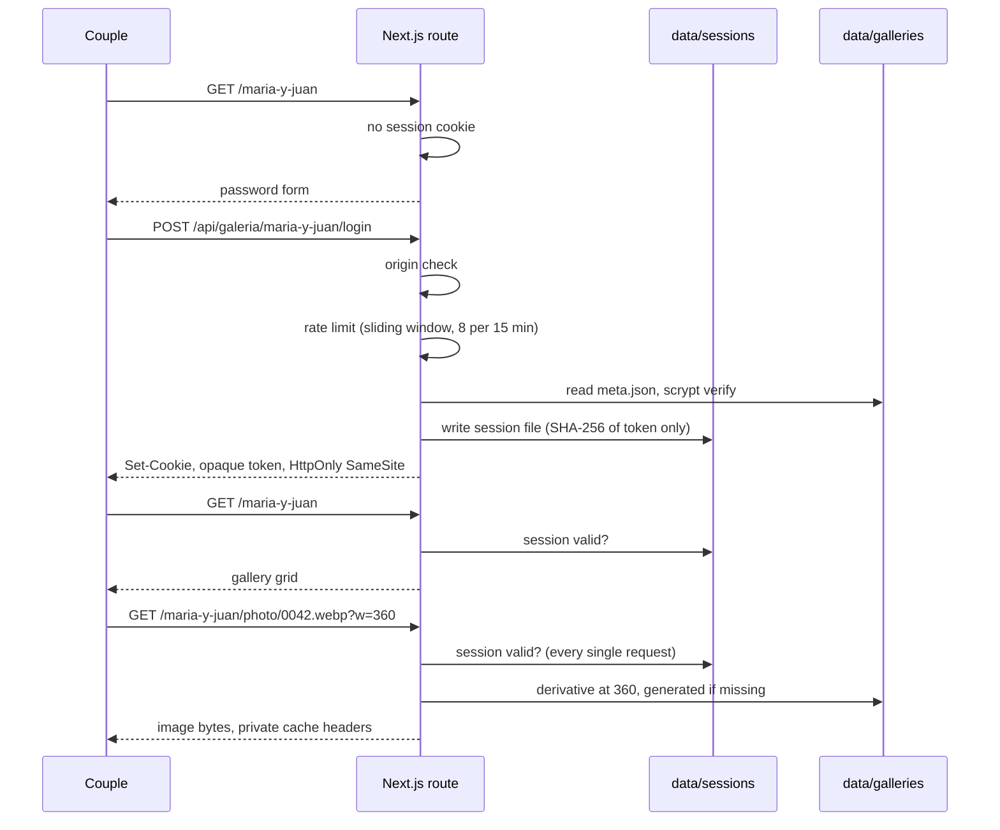
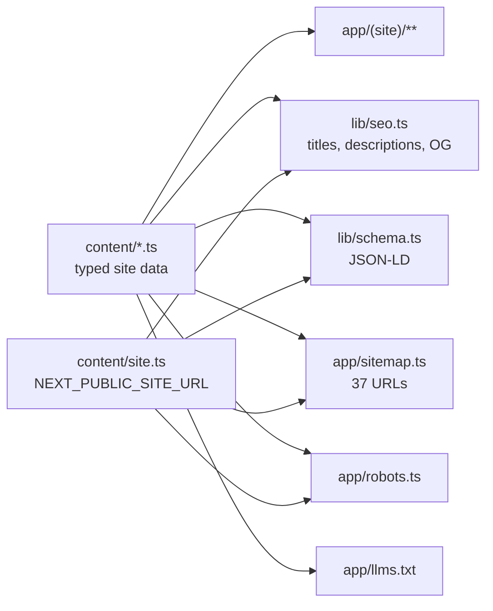
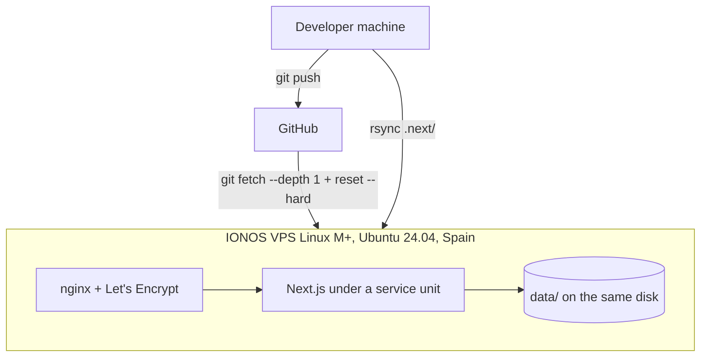

# Architecture

**Versión en español al final del documento.**

A wedding studio's site has an unusual shape. The public half is a portfolio that has to look
expensive and load fast. The private half is an authenticated application where two people log
in to look at two hundred photographs of their own wedding and tell the studio which ones they
want. They share a domain, a design system and a Node process, and almost nothing else.

This document explains how the two halves fit together and why several obvious choices were
rejected.

---

## 1. The shape of the system



One Node process, one disk, no database, no queue, no object store, no third-party backend. For
a business that photographs around thirty weddings a year, every one of those would be a moving
part with no work to do.

## 2. Why files instead of a database

The whole persistence layer is plain files under `data/`, which is gitignored and never served
statically.

```
data/
  galleries/<slug>/meta.json          gallery, client credentials, photo list
  galleries/<slug>/photos/<file>      the original photographs
  galleries/<slug>/derivatives/       generated smaller copies, cached
  galleries/<slug>/selection.json     what the couple liked and commented
  sessions/<hash>.json                one file per live session
  contact-submissions/<id>.json       enquiries from the contact form
  analytics/YYYY-MM-DD.ndjson         one line per page view
  admin/                              admin credential and recovery state
```

The reasoning, in order of weight:

1. **The data is naturally per-wedding.** A gallery is a directory. Deleting a wedding is
   deleting a directory. There is no relational question anyone needs to ask across weddings.
2. **The write volume is a rounding error.** A busy month is a few hundred selections and a
   dozen enquiries.
3. **A database is a second thing to back up, secure, upgrade and pay for.** On a single VPS it
   would be the most likely component to break and the hardest to restore.
4. **The photographs have to be on that disk anyway.** Putting the metadata anywhere else would
   split one wedding across two systems with no transaction between them.

The honest cost: this design assumes **one process on one machine**. Rate limiting is an
in-memory `Map`, and sessions and selections are files with no locking across hosts. Running two
replicas behind a load balancer would silently double the effective rate limit and give each
process a different view of memory state. That constraint is written at the top of
[`lib/auth/rate-limit.ts`](../lib/auth/rate-limit.ts) rather than left to be discovered.

## 3. The private gallery, which is the whole point



### Photographs never live under `public/`

This is the single decision the private half rests on. Anything under `public/` is served
statically by URL with no opportunity to run a check, so a filename that leaks once, through a
browser cache, a shared screenshot or a referrer header, defeats the password permanently and
silently.

Instead every image is served by
[`app/[slug]/photo/[filename]/route.ts`](../app/%5Bslug%5D/photo/%5Bfilename%5D/route.ts), which
revalidates the session on every request. Logging out cuts off the photographs, not only the
page around them.

The consequence is that `next/image` cannot be used here. Next's optimizer fetches the source
over HTTP without the session cookie, so against a gated route it gets a 401. The project
generates its own derivatives instead:
[`lib/gallery-derivatives.ts`](../lib/gallery-derivatives.ts) builds and caches a copy at each
of the four widths in [`lib/gallery-anchos.ts`](../lib/gallery-anchos.ts), and both the server
and the browser read that same width list, the server to validate `?w=` and the browser to write
`srcSet`.

That width list lives in its own file for an architectural reason, not tidiness. It used to sit
inside `gallery-derivatives.ts`, and importing it from a client component dragged `node:fs`,
`node:path` and sharp's native binary into the browser bundle, which Turbopack reports as
`Can't resolve 'child_process'`. The rule it fixes: a module that touches the filesystem cannot
also export a constant the client needs.

### Authentication, with no auth dependency

| Piece | Choice | Why not the usual thing |
|---|---|---|
| Password hashing | Node `crypto.scrypt`, `N=16384`, format `scrypt:salt:hash` | bcrypt and argon2 are native dependencies for a job Node's own crypto documents. The versioned prefix lets a future algorithm coexist with old hashes instead of invalidating every password at once. The cost factor is deliberately not raised: login routes are synchronous per request, so a heavier cost extends every legitimate login, not just an attacker's |
| Sessions | Opaque random tokens; disk stores only their SHA-256 | A JWT keeps validating after logout until it expires. An opaque token is revoked by deleting one file. Storing only the hash means a leaked backup yields nothing presentable as a cookie, for the same reason passwords are not stored in the clear |
| Session lifetime | Admin 7 days, client 30 days | Couples come back over weeks while deciding. A short session would only make them retype the password, and the same password gates access either way |
| Rate limiting | In-memory sliding window, with a hard cap on live keys | Without the cap, a spoofed `X-Forwarded-For` creates a new entry per request and the limiter becomes the denial of service it was meant to prevent. At the cap it purges expired windows first, and empties entirely if that is not enough: a momentary fail-open, preferable to falling over |
| Path handling | Format allowlists for slugs and filenames | A blocklist is a list of the traversal tricks you happened to think of |
| Mutating routes | Origin verified on every one | [`lib/auth/origin-check.ts`](../lib/auth/origin-check.ts) |

## 4. Analytics without cookies

[`lib/analytics-store.ts`](../lib/analytics-store.ts) appends one NDJSON line per page view:
timestamp, path, referrer host, device class from the viewport, optional UTM parameters, and a
visitor hash.

The visitor hash is `hash(daily rotating salt + IP + user agent)`, twelve hex characters. It
cannot be reversed, it is different tomorrow, and no IP is ever written. That is the model
Plausible and Fathom use, and the reason the Spanish AEPD and the French CNIL do not treat it as
requiring consent.

So the studio gets real numbers from the first visit, while the consent banner still loads
nothing third-party until the visitor chooses. Google Analytics exists as an option in
`.env.example` and loads only after an explicit accept.

The beacon route `POST /api/hit` is rate limited like everything else, and obvious bots are
filtered by user agent before anything is written.

## 5. The public half

Content is typed data, not markup. `content/` holds the projects, services, testimonials, FAQ
and site metadata as TypeScript, so the studio's words can be reviewed in one place without
touching layout, and so the tests can assert on them.



The canonical origin is read from the environment rather than hardcoded, because four modules
depend on it at once and a wrong canonical is the one failure capable of keeping the entire site
out of the search index.

### Motion

GSAP drives the scroll work and the cinematic intro, Lenis smooths the scroll itself. Every
motion component in `components/motion/` reads `prefers-reduced-motion` through
[`lib/hooks/useReducedMotion.ts`](../lib/hooks/useReducedMotion.ts) and has a still fallback,
and each ambient video carries a real pause control rather than an unstoppable autoplay. The
accessibility target is WCAG 2.1 AA.

## 6. Security headers

Defined in [`next.config.mjs`](../next.config.mjs) and written against what this site actually
loads rather than copied from a template: a real Content-Security-Policy, HSTS, `X-Frame-Options:
DENY` (kept alongside CSP `frame-ancestors` for older browsers), `X-Content-Type-Options`,
`Referrer-Policy: strict-origin-when-cross-origin` and a `Permissions-Policy`.

They are verified rather than trusted. [`scripts/pentest.mjs`](../scripts/pentest.mjs) attacks a
running server over HTTP the way a stranger would, which catches what a unit test structurally
cannot: a header that never arrives, a redirect that skips a check, a data file served by
accident. 61 checks, 61 passing against the published domain.

```bash
npm run pentest -- https://www.emefotografiasevilla.com
```

## 7. Deployment



The server takes the code and `public/` from GitHub and the built `.next/` by rsync. `data/` is
not in git and must not be: it holds client photographs, password hashes and session tokens.

The shallow clone is deliberate, and so is `git fetch --depth 1` plus `git reset --hard` rather
than `git pull`: on a server nobody edits anything, and a hard reset to the remote is exactly the
semantics wanted. The full runbook, including why Vercel and IONOS Deploy Now were rejected, is
in [DESPLIEGUE.md](DESPLIEGUE.md).

## 8. Known constraints

Stated plainly, because a design with no acknowledged costs is a design that has not been
examined.

| Constraint | Effect | When it has to change |
|---|---|---|
| Single process assumed | Rate limiter and in-memory state are per process | Before any second replica or serverless runtime. Replace with a shared counter or the provider's own rate limiting |
| `data/` on the instance disk | Backups are a disk concern, not a database concern | If hosting ever moves to ephemeral instances |
| 626 MB of media tracked in git | A full clone is around 830 MB, and CI has to work around it | Planned, see [PLAN-MEDIA-FUERA-DE-GIT.md](PLAN-MEDIA-FUERA-DE-GIT.md). Deliberately not done while the studio and its clients work from the live site |
| Default branch is `worktree-eme-fotografia-build` | Cosmetic, but production pulls that exact name | Together with the change above |

---

# Arquitectura

La web de un estudio de bodas tiene una forma poco corriente. La mitad pública es un portafolio
que tiene que parecer caro y cargar rápido. La mitad privada es una aplicación con sesión donde
dos personas entran a ver doscientas fotos de su propia boda y decirle al estudio cuáles
quieren. Comparten dominio, sistema de diseño y proceso de Node, y casi nada más.

Este documento explica cómo encajan las dos mitades y por qué se descartaron varias opciones
evidentes.

## 1. La forma del sistema

Un proceso de Node, un disco, sin base de datos, sin cola, sin almacenamiento de objetos y sin
backend de terceros. Para un negocio que fotografía unas treinta bodas al año, cada una de esas
piezas sería algo que mantener sin trabajo que hacer. El diagrama está arriba, en la sección 1
en inglés.

## 2. Por qué ficheros y no base de datos

Toda la persistencia son ficheros bajo `data/`, que está fuera de git y nunca se sirve en
estático. Las razones, por peso:

1. **Los datos son por boda de forma natural.** Una galería es una carpeta. Borrar una boda es
   borrar una carpeta. No hay ninguna pregunta relacional que alguien necesite hacer entre bodas.
2. **El volumen de escritura es ruido.** Un mes ocupado son unos cientos de selecciones y una
   docena de consultas.
3. **Una base de datos es una segunda cosa que respaldar, asegurar, actualizar y pagar.** En un
   único VPS sería la pieza con más papeletas de romperse y la más difícil de restaurar.
4. **Las fotos tienen que estar en ese disco de todas formas.** Poner los metadatos en otro
   sitio partiría una boda en dos sistemas sin transacción entre ellos.

El coste, dicho claro: este diseño da por hecho **un proceso en una máquina**. El limitador de
intentos es un `Map` en memoria, y las sesiones y las selecciones son ficheros sin bloqueo entre
máquinas. Dos réplicas detrás de un balanceador duplicarían el límite efectivo en silencio. Esa
condición está escrita arriba del todo en [`lib/auth/rate-limit.ts`](../lib/auth/rate-limit.ts)
en lugar de dejarse para que alguien la descubra.

## 3. La galería privada, que es de lo que va todo

### Las fotos nunca viven en `public/`

Es la decisión sobre la que se apoya toda la mitad privada. Lo que está en `public/` se sirve en
estático por URL sin ninguna oportunidad de comprobar nada, así que un nombre de fichero que se
filtre una vez, por una caché del navegador, una captura compartida o una cabecera de referente,
derrota la contraseña para siempre y sin ruido.

En su lugar, cada imagen la sirve
[`app/[slug]/photo/[filename]/route.ts`](../app/%5Bslug%5D/photo/%5Bfilename%5D/route.ts), que
vuelve a validar la sesión en cada petición. Cerrar sesión corta las fotos, no solo la página
que las rodea.

La consecuencia es que aquí no se puede usar `next/image`: el optimizador de Next pide la imagen
por HTTP sin la cookie de sesión, así que contra una ruta con contraseña recibe un 401. El
proyecto genera sus propias copias reducidas en
[`lib/gallery-derivatives.ts`](../lib/gallery-derivatives.ts), a los cuatro anchos de
[`lib/gallery-anchos.ts`](../lib/gallery-anchos.ts), y esa lista la leen los dos lados: el
servidor para validar el `?w=` y el navegador para escribir el `srcSet`.

Esa lista vive en su propio fichero por arquitectura, no por orden. Estaba dentro de
`gallery-derivatives.ts`, y al importarla un componente de cliente se traía `node:fs`,
`node:path` y el binario nativo de sharp al paquete del navegador, que Turbopack corta con un
«Can't resolve 'child_process'». La regla que fija: un módulo que toca el sistema de ficheros no
puede exportar además una constante que necesita el cliente.

### Autenticación sin dependencias de autenticación

La tabla completa está en la sección 3 en inglés. En resumen: `scrypt` del `crypto` de Node con
formato versionado, tokens de sesión opacos de los que en disco solo se guarda el SHA-256,
limitador de ventana deslizante con tope de claves vivas para que un `X-Forwarded-For`
falsificado no lo convierta en la denegación de servicio que venía a evitar, listas de
permitidos de formato para slugs y nombres de fichero, y comprobación de origen en toda ruta que
modifica algo.

## 4. Analítica sin cookies

Una línea NDJSON por visita: momento, ruta, host del referente, clase de dispositivo por el
ancho del viewport, parámetros UTM si los hay, y un hash de visitante.

El hash es `hash(sal que rota a diario + IP + agente de usuario)`, doce caracteres. No se puede
revertir, mañana vale otra cosa y la IP no se guarda en ningún momento. Es el modelo de
Plausible y Fathom, y la razón por la que la AEPD y la CNIL no lo tratan como algo que necesite
consentimiento. El estudio tiene números desde la primera visita mientras el banner sigue sin
cargar nada de terceros hasta que el visitante decide.

## 5. La mitad pública

El contenido son datos tipados, no marcado: `content/` guarda reportajes, servicios, testimonios,
FAQ y metadatos como TypeScript, para que las palabras del estudio se revisen en un solo sitio y
los tests puedan comprobarlas.

El origen canónico se lee del entorno y no está escrito en el código, porque de él dependen
cuatro módulos a la vez y un canonical equivocado es el único fallo capaz de dejar la web entera
fuera del índice de Google.

## 6. Cabeceras de seguridad

Están en [`next.config.mjs`](../next.config.mjs), escritas contra lo que esta web carga de
verdad. Y se comprueban en vez de darse por buenas:
[`scripts/pentest.mjs`](../scripts/pentest.mjs) ataca al servidor por HTTP como lo haría alguien
de fuera. 61 comprobaciones, 61 correctas contra el dominio publicado.

## 7. Despliegue

El servidor coge el código y `public/` de GitHub, y el `.next/` ya construido por rsync. `data/`
no está en git y no debe estarlo: ahí viven las fotos de clientes, los hashes de contraseñas y
los tokens de sesión. El runbook completo está en [DESPLIEGUE.md](DESPLIEGUE.md).

## 8. Condiciones conocidas

La tabla está en la sección 8 en inglés. Las cuatro, en corto: se da por hecho un solo proceso;
`data/` vive en el disco de la instancia; hay 626 MB de material dentro de git, con plan de
salida en [PLAN-MEDIA-FUERA-DE-GIT.md](PLAN-MEDIA-FUERA-DE-GIT.md); y la rama por defecto se
llama `worktree-eme-fotografia-build`, que es cosmético pero producción clona ese nombre exacto.
